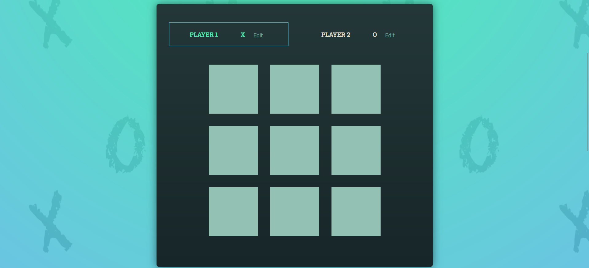
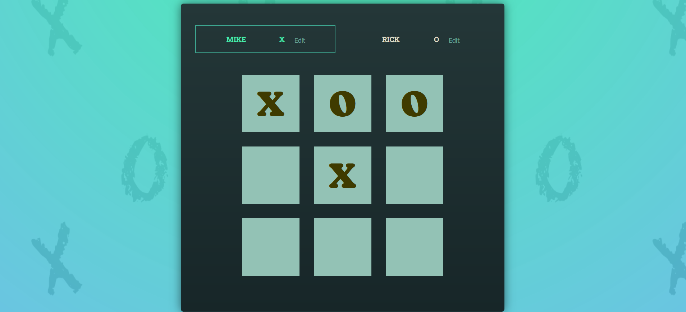
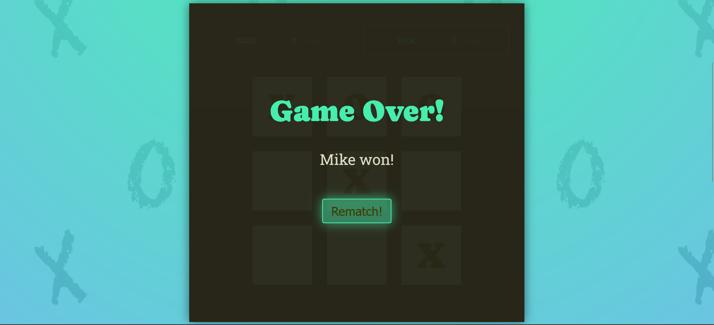

# 🎮 Tic-Tac-Toe (React) 

A dynamic Tic-Tac-Toe game built with **React + Vite**, featuring player turns, win detection, 
and a sleek UI.

## ✨ Features
- **Interactive Gameboard**: Clickable grid with X/O turns.
- **Win Detection**: Checks all winning combinations.
- **Player Logs**: Tracks moves in real-time.
- **Game Over Screen**: Announces winners/draws.

## 🛠️ Tech Stack
- **Frontend**: React.js, Vite  
- **Styling**: CSS3 (Flexbox/Grid)  
- **Assets**: SVGs, PNG backgrounds  

## Installation and Setup

1. Clone the repository to your local machine.
2. Navigate to the project directory and run `npm install` to install all dependencies.
3. Run `npm run dev` to start the application.
4. Open `http://localhost:5173/` in your browser to view the website.

## 🖼️ Screenshots

*Game header section*

*Main game interface*

*Playing game*

*Winner announcement*

Thank you! 🤍
– Darshana Chinde
